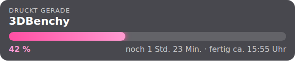
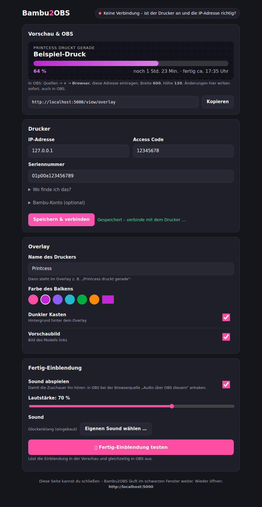

# Bambu2OBS – Druck-Overlay für OBS (Anleitung auf Deutsch)

Dieses Overlay zeigt in OBS live an, **was gerade gedruckt wird**, einen **pinken Fortschrittsbalken** und **wie lange der Druck noch braucht** (inklusive voraussichtlicher Uhrzeit, wann er fertig ist).



Das Programm läuft auf dem PC, auf dem auch OBS läuft, und liest die Daten direkt vom Bambu-Drucker im eigenen WLAN aus.

---

## 1. Was du brauchst

- Einen **Bambu Lab Drucker** (X1, P1, A1 …) im selben Netzwerk wie der PC
- **OBS Studio** auf einem Windows-PC

Python oder sonstige Programme brauchst du **nicht**.

## 2. Herunterladen

1. Rechts auf dieser GitHub-Seite unter **„Releases“** die neueste Version öffnen.
2. **`Bambu2OBS-Windows-….zip`** herunterladen und in einen eigenen Ordner entpacken, z. B. `C:\Bambu2OBS`.

## 3. Erster Start

1. **`Bambu2OBS.exe`** doppelklicken.
   Falls Windows „Der Computer wurde durch Windows geschützt“ anzeigt: auf **„Weitere Informationen“** → **„Trotzdem ausführen“** klicken. (Das kommt bei kleinen Programmen ohne gekaufte Signatur.)
2. Es öffnet sich ein schwarzes Fenster – und im Browser automatisch die **Einstellungsseite**.
3. Dort **IP-Adresse**, **Access Code** und **Seriennummer** eintragen und auf **„Speichern & verbinden“** klicken. Wo du die Angaben findest, steht im nächsten Abschnitt (und auf der Seite unter „Wo finde ich das?“).
4. Oben rechts erscheint **„Mit dem Drucker verbunden“** – fertig.



Die Einstellungsseite erreichst du jederzeit unter **http://localhost:5000**, solange Bambu2OBS läuft. Dort stellst du auch alles fürs Overlay ein (siehe Abschnitt 6). Alle Einstellungen werden fest in Windows gespeichert (`%APPDATA%\Bambu2OBS`), nicht im Programmordner – bei einem Update bleiben sie also erhalten.

### Wo finde ich IP-Adresse, Access Code und Seriennummer?

Die Menünamen können je nach Modell und Firmware leicht abweichen.

**IP-Adresse und Access Code** stehen direkt am Drucker-Display:

- **A1 / A1 mini / P1S / P1P:** Zahnrad (Einstellungen) → **WLAN**. Dort stehen die IP-Adresse (z. B. `192.168.178.45`) und der **Access Code** (8 Zeichen aus Zahlen und Buchstaben).
- **X1 / X1C:** Zahnrad → Reiter **Netzwerk**. Dort stehen dieselben Angaben.

Den Access Code am besten direkt beim ersten Start vom Display ablesen. Er kann sich ändern, z. B. nachdem der Drucker zurückgesetzt wurde.

**Seriennummer**, eine dieser Stellen reicht:

- Am Drucker: Einstellungen → **Gerät** bzw. Geräteinformationen
- In **Bambu Handy** (Handy-App): Drucker antippen → Einstellungen → Geräteinformationen
- In **Bambu Studio**: Reiter **Gerät** → Bereich **Update**, dort steht sie neben der Firmware-Version
- Auf dem Aufkleber am Drucker (meist hinten oder unten), die Nummer hinter „SN“

## 4. Jedes Mal vor dem Streamen

**`Bambu2OBS.exe`** starten und das schwarze Fenster offen lassen, solange das Overlay laufen soll. Zum Beenden das Fenster schließen. Die Einstellungsseite brauchst du dafür nicht – die kannst du zumachen.

## 5. Alternative: mit Python starten (für Bastler)

Mit installiertem Python 3 im Projektordner:

```
python -m venv b2obsvenv
b2obsvenv\Scripts\activate
pip install -r requirements.txt
python src\bambu2obs.py
```

## 6. In OBS einbinden

1. In OBS bei **Quellen** auf **+** → **Browser** klicken.
2. Als URL eintragen (auf der Einstellungsseite gibt es dafür einen **Kopieren**-Knopf):

   ```
   http://localhost:5000/view/overlay
   ```

3. **Breite: 600**, **Höhe: 130** – fertig. Die Quelle lässt sich danach beliebig im Bild verschieben und skalieren.
4. Damit die Zuschauer den Fertig-Sound hören: in den Eigenschaften der Browserquelle **„Audio über OBS steuern“** anhaken. Der Sound erscheint dann im Audio-Mixer als eigene Spur und geht mit in den Stream. Wenn du ihn selbst auch hören willst: im Mixer bei der Quelle auf ⚙️ → **Erweiterte Audioeigenschaften** → Audioüberwachung **„Überwachen und ausgeben“**.

### Aussehen und Sound einstellen

Alles auf der Einstellungsseite **http://localhost:5000** – mit Live-Vorschau. Änderungen wirken **sofort auch in OBS**, an der Adresse in OBS musst du nie etwas ändern.

- **Name des Druckers**, z. B. „Printcess“ → im Overlay steht „Printcess druckt gerade“, „Printcess macht Pause“, „Printcess ist fertig!“
- **Farbe des Balkens** (Pink, Lila, Türkis … oder eigene Farbe)
- **Dunkler Kasten** und **Vorschaubild** an/aus
- **Fertig-Sound** an/aus, **Lautstärke**, **eigenen Sound hochladen** (MP3, WAV oder OGG)
- **„Fertig-Einblendung testen“** – löst die Einblendung sofort in der Vorschau und in OBS aus

### Die Fertig-Einblendung

Sobald der Drucker fertig ist, gibt es Konfetti, der Kasten leuchtet, dort steht z. B. „Printcess ist fertig! 🎉“ und es ertönt ein kurzer Glockenklang (oder dein eigener Sound). Sie kommt nur, wenn ein Druck wirklich gerade fertig wird – nicht, wenn OBS neu gestartet wird.

<details>
<summary>Für Bastler: Einstellungen per URL überschreiben</summary>

An die OBS-Adresse angehängt, haben diese Werte Vorrang vor der Einstellungsseite – praktisch z. B. für eine zweite Szene mit anderem Aussehen:
`?name=Printcess`, `?color=ff4fa3`, `?card=0`, `?cover=0`, `?sound=0`, `?volume=40`, `?test=fertig` (zeigt dauerhaft die Fertig-Einblendung, nur zum Ausprobieren). Mehrere kombinieren mit `&`.
</details>

## 7. Auf eine neue Version updaten

1. Bambu2OBS schließen (das schwarze Fenster).
2. Unter **„Releases“** auf dieser GitHub-Seite die neueste `Bambu2OBS-Windows-….zip` herunterladen.
3. Die neue **`Bambu2OBS.exe`** über die alte kopieren, oder einfach woanders entpacken – egal wohin.
4. Bambu2OBS starten. Deine Einstellungen und ein eigener Sound sind gespeichert, du musst nichts neu eingeben. Auch in OBS bleibt alles, wie es ist. Falls das Overlay in OBS noch alt aussieht: Browserquelle anklicken → **„Seite aktualisieren“** bzw. in den Eigenschaften „Cache der aktuellen Seite aktualisieren“.

Die Versionsnummer steht im Namen der ZIP-Datei, z. B. `Bambu2OBS-Windows-v1.2.0.zip`. Ist die Nummer auf GitHub höher als bei deiner Datei, gibt es etwas Neues.

## 8. Wenn etwas nicht klappt

- **Einstellungsseite geht nicht auf:** Läuft das schwarze Fenster? Dann im Browser **http://localhost:5000** eintippen.
- **Overlay bleibt leer / zeigt „–“:** Läuft das schwarze Fenster von Bambu2OBS noch? Startet gerade ein Druck? Die Daten kommen erst, sobald der Drucker welche sendet.
- **Keine Verbindung zum Drucker:** Auf der Einstellungsseite (http://localhost:5000) steht oben rechts, was los ist. IP-Adresse und Access Code nochmal prüfen und speichern. Bei neueren Firmware-Versionen muss am Drucker eventuell der **LAN-Modus** bzw. **Entwicklermodus** aktiviert werden, damit externe Programme mitlesen dürfen.
- **Kein Vorschaubild:** Das Bild wird bei jedem neuen Druck von der **SD-Karte im Drucker** geholt. Ohne SD-Karte geht das nicht. Bei einem Druck, der schon lief, bevor Bambu2OBS gestartet wurde, kann es ein paar Sekunden dauern.
- **Overlay ging, nach ein paar Tagen aber nicht mehr:** Der Router hat dem Drucker vermutlich eine neue IP-Adresse gegeben. Im Router eine feste Adresse einstellen (FritzBox: **Heimnetz → Netzwerk** → beim Drucker auf den Stift klicken → **„Diesem Netzwerkgerät immer die gleiche IPv4-Adresse zuweisen“**). Danach auf der Einstellungsseite die neue IP-Adresse eintragen und speichern.
